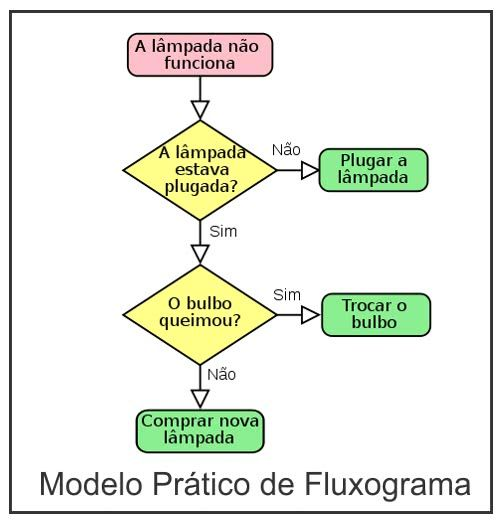

# O que é um Fluxograma?

**Fluxogramas** são um tipo de diagrama que pode ser entendido como um passo a passo de processo ou algoritmo, normalmente feitos através de gráficos que ilustram de forma simples a transição de informações entre os elementos que os compõem.

- Os fluxogramas são muito utilizados em projetos de software para representar a lógica interna dos códigos.

- Cada "caixinha" em um fluxograma representa um tipo diferente de procedimento. Veremos mais nas próximas leituras.

## Exemplo

  

---

### Ir para: [Início](/README.md) | [Configurando o Ambiente](./3-Ambiente.md)
