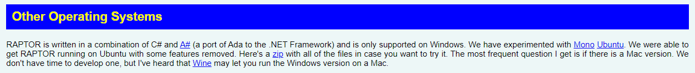

# Configurando o ambiente

## Windows

Para instalar o Raptor no Windows, acesse o [site oficial](https://raptor.martincarlisle.com/) e clique no botão de download. Avance as opções no instalador e pronto, tudo feito!

  

## Outros Sistemas Operacionais

Para instalar o Raptor em outros Sistemas operacionais, acesse o [site oficial](https://raptor.martincarlisle.com/) e verifique a sessão abaixo, nela há instruções sobre como usar no Ubuntu (Linux) e no MacOS.

  

---

### Ir para: [Início](/README.md) | [Entendendo a janela principal](./4-Intro.md)
