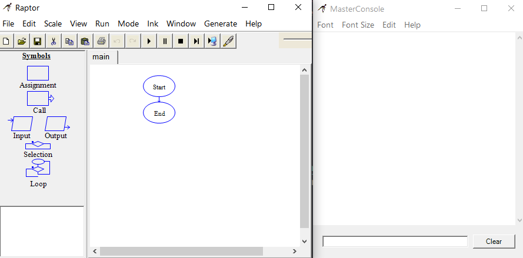
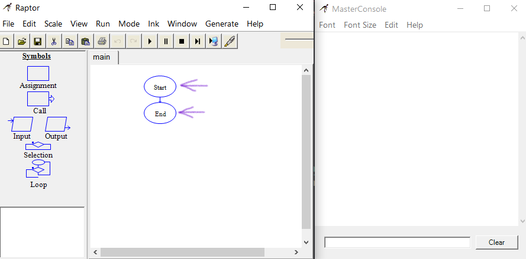
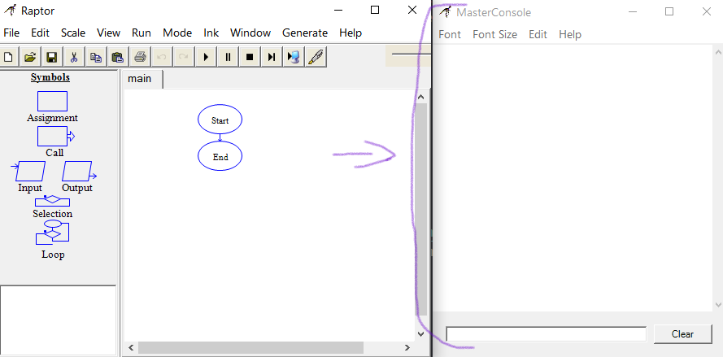
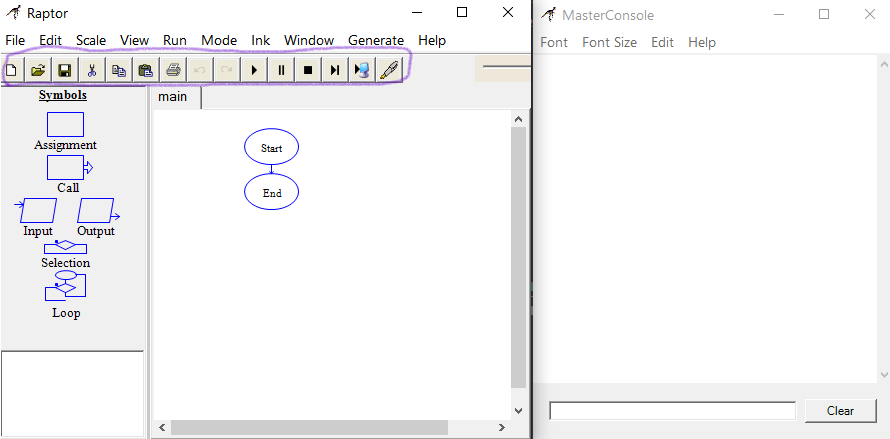
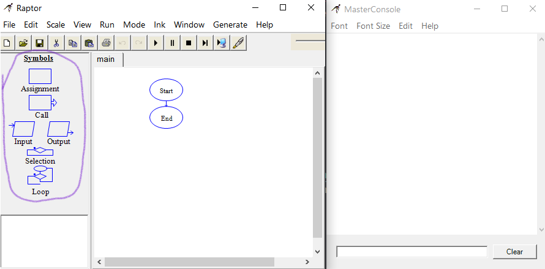

# Entendendo a janela principal

## Tela inicial

Ao abrir o Raptor, você irá se deparar com duas janelas, a janela principal (na esquerda) onde contruiremos nossos algoritmos e o Master Console (na direita), onde serão exibidas determinadas informações sobre as etapas do fluxograma e também possíveis erros.

  

---

## Start e End

- No que consistem essas duas "bolhas"?

  Basicamente, consistem no início e fim do programa. Todo programa Raptor se inicia no Start e termina no End.
  O espaço no meio dessas duas "bolhas" é onde iremos fazer nosso algoritmo.

  

---

## Master Console

O Master Console nada mais é do que um console de desenvolvedor, nele aparecerão mensagens relativas a execução do programa bem como eventuais erros.

  

---

## Barra de ações

Na barra de ações, encontramos, respectivamente os botões para:

- Criar um novo programa;
- Abrir um programa existente;
- Salvar o programa atual;
- Cortar, copiar e colar algum símbolo;
- Imprimir um fluxograma;
- Desfazer um passo, refazer um passo;
- Iniciar a execução do fluxograma;
- Pausar a execução do mesmo;
- Parar a execução;
- Avançar um passo na execução;
- Testar o fluxograma num servidor;
- Utilizar a caneta marcadora.

  

---

## Símbolos

Os símbolos são a parte que será utilizada para criar a lógica do nosso fluxograma. Na próxima leitura, vamos entender melhor o que cada um deles faz.

  

### Ir para: [Início](/README.md) | [Símbolos](./5-Simbolos.md)
