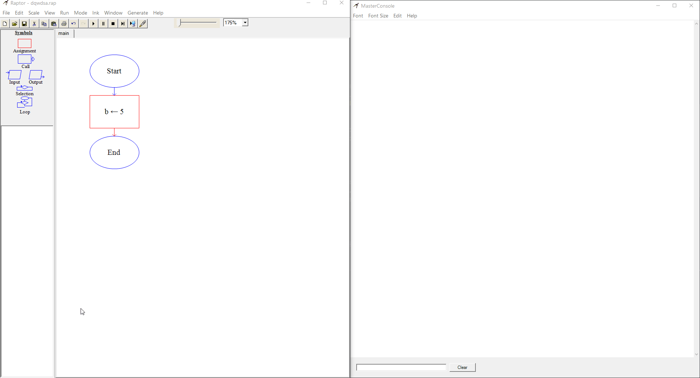
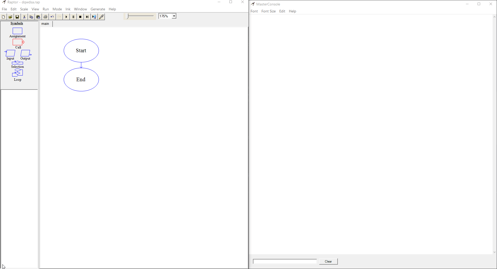
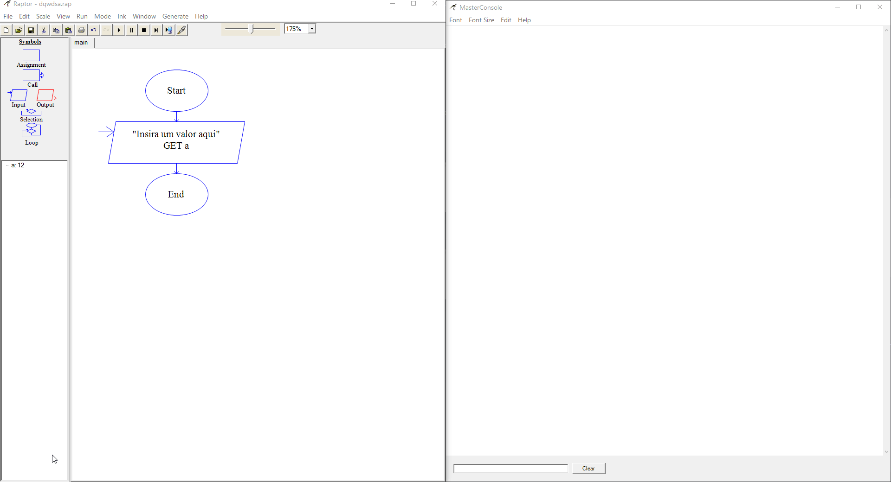
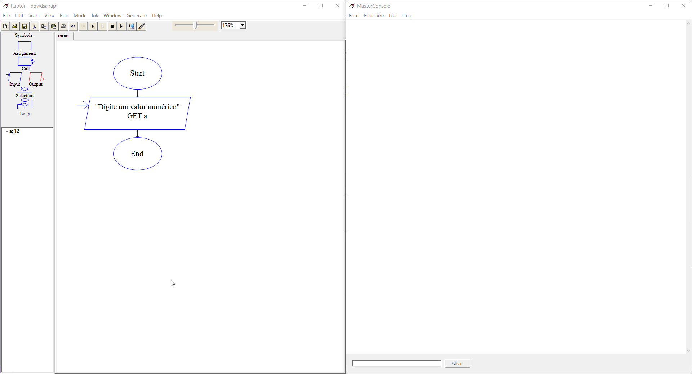
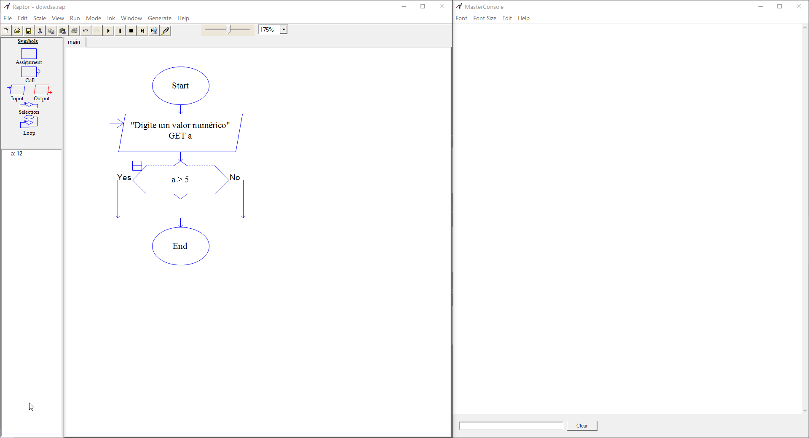
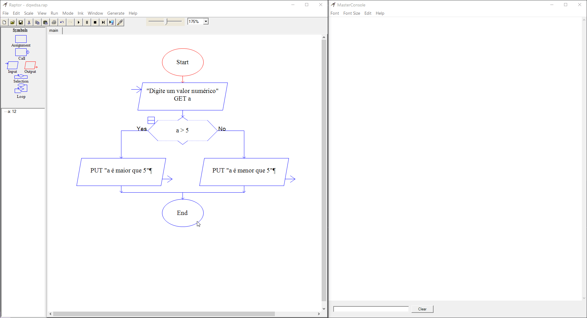

# Símbolos (_Symbols_)

Os símbolos são os componentes principais de um programa Raptor, eles são responsáveis por armazenar variáveis, fazer loops, realizar verificações e trabalhar com entradas do usuário e saída de informações para o mesmo.

  

## Em ordem, temos

1. _Assignment_: É o símbolo que funciona como uma variável para armazenar informações

  

Como podemos ver, após inserir o Assignment no nosso programa, ele abre uma janela que nos permite dar um nome a variável que queremos armazenar e seu valor inicial (sempre é esperado um valor inicial).

2. _Call_: O símbolo _Call_ serve para trabalhar com funções pré-feitas do Raptor. Como não é de grande utilidade para o estudo, não trabalharemos com ela.

  

Esse símbolo também abre uma janela, nela há uma caixa de texto que nos permite chamar alguma função que já vem pronta no Raptor, como abrir uma janela de gráfico ou esperar que um botão seja pressionado.

---

3. _Input_: O símbolo _Input_ serve para trabalhar com entrada de dados pelo usuário, nela podemos definir o texto do prompt exibido em tela e o nome da variável a qual desejamos associar o valor lido na resposta do usuário.

OBS: Lembre-se sempre de que todo texto que desejamos inserir tanto no _Input_ como no _Output_ deve ser entre aspas duplas, com exceção de variáveis, que devem ser inseridas após um sinal de mais (**+**) e fora das aspas.

  

---

4. _Output_: O símbolo _Output_ serve para exibir na tela do usuário qualquer tipo de texto, também é possível incluir varíaveis nesse texto. A saída desse símbolo sempre ocorre no _Master Console_.

  

---

5. _Selection_: O símbolo _Selection_ funciona para realizar verificações de condições. Caso algo seja verdadeiro ele seguirá um caminho (o caminho da esquerda), caso seja falso, seguirá outro caminho (o caminho da direita).

Nesse símbolo podemos usar operadores aritméticos como:

- `>` : Maior que;
- `<` : Menor que;
- `>=` : Maior ou igual que;
- `<=` : Menor ou igual que;
- `==` : Igual a.

Vejamos um exemplo simples: Temos um símbolo de _Input_ que armazena o valor lido numa variável `a`. Vamos realizar uma verificação:

- Caso o valor lido seja maior que 5, ele vai exibir em tela com o símbolo _Output_: "a é maior que 5"
- Caso o valor lido seja menor que 5, ele vai exibir em tela com o mesmo símbolo _Output_: "a é menor que 5"

Primeiro passo: Vamos colocar o símbolo _Selection_ no nosso fluxograma e definir a condição dele

  

Segundo passo: Vamos colocar nossos textos de saída com o símbolo _Output_

  

Terceiro passo: Vamos testar!

  

Pronto, temos um pequeno algoritmo que verifica se o número inserido pelo usuário é maior que 5 :D

OBS.: Podemos perceber que o Raptor sempre marca em verde qual etapa do fluxograma está executando no momento, podemos usar isso como forma de encontrar erros e verificar se nossa lógica está certa

---

## Loop

O símbolo _Loop_ funciona exatamente como o nome sugere, ele é um loop, uma repetição, que fica acontecendo enquanto a condição especificada não é verdadeira.

Vejamos outro exemplo: Temos uma variável `a` que começa com valor 0. Queremos somar 1 em `a` até que ela chegue a 10.

Primeiro passo: Vamos colocar o símbolo _Selection_ no nosso fluxograma e definir a condição dele

  

Segundo passo: Vamos colocar nossos textos de saída com o símbolo _Output_

  

Terceiro passo: Vamos testar!

  

Pronto, temos um pequeno algoritmo que verifica se o número inserido pelo usuário é maior que 5 :D

### Ir para: [Início](/README.md) | [Fazendo um Algoritmo simples](./5-Algoritmo.md)
