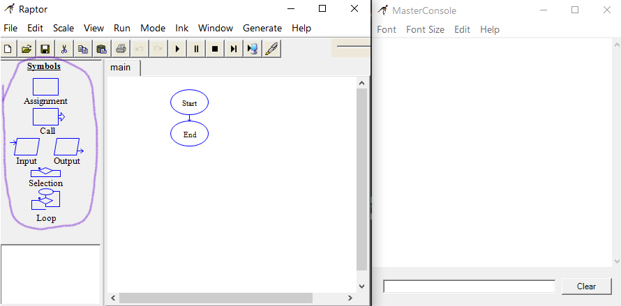

# Símbolos (_Symbols_)

Os símbolos são os componentes principais de um programa Raptor, eles são responsáveis por armazenar variáveis, fazer loops, realizar verificações e trabalhar com entradas do usuário e saída de informações para o mesmo.

  

## Em ordem, temos

1. _Assignment_: É o símbolo que funciona como uma variável para armazenar informações

<!-- Inserir Gif -->

Como podemos ver, após inserir o Assignment no nosso programa, ele abre uma janela que nos permite dar um nome a variável que queremos armazenar e seu valor inicial

<!-- Inserir imagem da caixa do Assignment -->

2. _Call_: O símbolo _Call_ serve para trabalhar com funções pré-feitas do Raptor. Como não é de grande utilidade para o estudo, não trabalharemos com ela.

<!-- Inserir Gif -->

Esse símbolo também abre uma janela, nela há uma caixa de texto que nos permite chamar alguma função que já vem pronta no Raptor, como abrir uma janela de gráfico ou esperar que um botão seja pressionado.

<!-- Inserir imagem da caixa do Call -->

---

### Ir para: [Início](/README.md) | [Fazendo um Algoritmo simples](./5-Algoritmo.md)